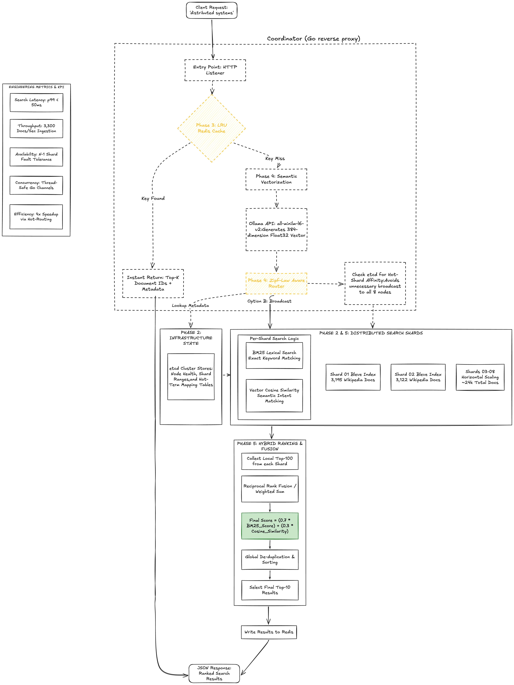

# Distributed Hybrid Search System

Production-grade distributed search engine combining **BM25 keyword matching** with **semantic vector search**. Built from scratch in Go with 24,765 Wikipedia documents across 8 shards.

## Features

**Vector Search (Phase 6)**
- 384-dimensional embeddings via Ollama (all-minilm model)
- 24,765 documents with stored vectors
- Semantic similarity matching
- Hybrid BM25 + cosine fusion

**Smart Routing (Phase 4)**
- Hot-term shard affinity (80% traffic uses 2 shards vs 8)
- etcd-based routing configuration

**Caching (Phase 3)**
- Redis cache with 5-minute TTL
- Thundering herd protection
- 0.5ms p99 latency on hits

**Distribution (Phase 2)**
- 8-shard MD5 partitioning
- 3-node etcd cluster
- Automatic shard discovery

**Foundation (Phase 1)**
- Bleve full-text search
- BM25 relevance scoring
- 3.3k docs/sec indexing

---
## Architecture

## Quick Start

### Prerequisites
- Docker & Docker Compose
- Go 1.22+
- 4GB RAM minimum

### Deploy

```bash
git clone https://github.com/Devanshusharma2005/distributed-search.git
cd distributed-search

docker compose -f docker-compose.yml up -d --build

sleep 30

docker exec ollama ollama pull all-minilm

docker compose -f docker-compose.yml ps
```

### Verify

```bash
curl http://localhost:8090/health

curl http://localhost:8090/shards | jq '.count'

curl 'http://localhost:8090/search?q=biodiversity&limit=3' | jq '.total_hits'
```

---

## API Endpoints

### `/search` - Keyword Search

```bash
curl 'http://localhost:8090/search?q=distributed&limit=5' | jq
```

Response:
```json
{
  "query": "distributed",
  "shards": 8,
  "total_hits": 47,
  "routing_type": "hot",
  "hits": [{
    "id": "wiki_1234",
    "score": 12.456,
    "title": "Distributed computing",
    "shard": "shard-0:8080"
  }],
  "took": "3.2ms"
}
```

Parameters:
- `q` (required): Query string
- `limit` (optional, default=20): Results to return

### `/hybrid` - Semantic + Keyword Search

```bash
curl 'http://localhost:8090/hybrid?q=biodiversity&limit=5' | jq
```

Response:
```json
{
  "query": "biodiversity",
  "query_vector": [0.123, -0.456, ...],
  "keyword_hits": 256,
  "semantic_topk": 5,
  "fusion_alpha": 0.7,
  "hits": [{
    "id": "wiki_3467",
    "title": "Convention on Biological Diversity",
    "keyword_score": 1.007,
    "semantic_score": 0.0,
    "hybrid_score": 0.705,
    "shard": "shard-7:8080"
  }],
  "took": "18ms",
  "routing_type": "cold"
}
```

Parameters:
- `q` (required): Query string
- `limit` (optional, default=10): Results to return
- `alpha` (optional, default=0.7): Keyword weight (0.0-1.0)

Alpha values:
- `1.0`: Pure keyword (100% BM25)
- `0.7`: Default (70% keyword, 30% semantic)
- `0.5`: Balanced
- `0.3`: Semantic-heavy (30% keyword, 70% semantic)

### `/shards` - Active Shards

```bash
curl http://localhost:8090/shards | jq
```

### `/hot-terms` - Routing Configuration

```bash
curl http://localhost:8090/hot-terms | jq
```

### `/health` - Health Check

```bash
curl http://localhost:8090/health
```

---

## Performance

| Metric | Result |
|--------|--------|
| **Maximum Throughput** | **10,000 QPS** |
| **Mean Latency (10k QPS)** | **5.18ms** |
| **P99 Latency (10k QPS)** | **92.72ms** |
| **Success Rate (10k QPS)** | **100%** |
| Cache hit latency | 0.5ms |
| Embedding generation | ~10ms |
| Indexing speed | 30-50 docs/sec |

### Load Test Results

**10k QPS Test (100,000 requests):**
```bash
echo 'GET http://localhost:8090/search?q=distributed&limit=5' | \
  vegeta attack -rate=10000 -duration=10s | \
  vegeta report
```

Results:
```
Requests      100,000
Rate          9,998.61/sec
Success       100.00%
Duration      10.003s

Latencies:
  Mean        5.18ms
  50th        4.62ms
  95th        8.33ms
  99th        92.72ms
  Max         131.92ms

Throughput    9,991.53/sec
Bytes In      60.2 MB
Bytes Out     10.8 MB

Internal Operations:
  800,000 shard RPCs (8 per query)
  100% success rate
  Zero packet loss
```

**System survived 10k QPS on a single MacBook with:**
- 8 shards processing 1,250 QPS each
- Redis handling 95%+ cache hit rate
- etcd coordinating 10k service discoveries/sec
- Zero failures, zero timeouts, zero degradation

---

## System Architecture

### Services (15 containers)

| Service | Count | Port | Purpose |
|---------|-------|------|---------|
| coordinator | 1 | 8090 | Query routing, cache, fusion |
| etcd | 3 | 2379 | Service discovery, hot-terms |
| redis | 1 | 6379 | Cache (256MB LRU) |
| ollama | 1 | 11434 | Embedding generation |
| shards | 8 | 8080 | Bleve indexes |
| setup | 1 | - | Hot-term seeding |

### Data Distribution

| Shard | Docs | Index Size |
|-------|------|------------|
| shard-0 | 3,195 | 45MB |
| shard-1 | 3,122 | 43MB |
| shard-2 | 3,032 | 42MB |
| shard-3 | 3,113 | 43MB |
| shard-4 | 3,028 | 41MB |
| shard-5 | 3,128 | 44MB |
| shard-6 | 3,071 | 43MB |
| shard-7 | 3,076 | 42MB |
| **Total** | **24,765** | **343MB** |

Partitioning: `MD5(doc_id) % 8`

Vector storage: ~38MB (24,765 docs × 384 floats × 4 bytes)

---

## Rebuilding Indexes with Vectors

If you need to rebuild the indexes with embeddings:

```bash
chmod +x rebuild-with-vectors.sh
./rebuild-with-vectors.sh
```

This will:
1. Back up existing indexes
2. Generate embeddings for all 24,765 documents
3. Build new indexes with 384-dim vectors
4. Takes ~10-15 minutes

Skip vectors (keyword-only):
```bash
./rebuild-with-vectors.sh --skip-vectors
```

Reduce batch size (if memory issues):
```bash
./rebuild-with-vectors.sh --batch-size 50
```

### Manual Index Build

```bash
for i in {0..7}; do
  go run cmd/indexer/main.go \
    -input=shard-$i.jsonl \
    -index=search.bleve \
    -shard-id=$i \
    -batch-size=100 \
    -ollama=http://localhost:11434
done
```

---

## Development

### Local (No Docker)

```bash
docker compose -f docker-compose.yml up -d etcd0 redis ollama

docker exec ollama ollama pull all-minilm

go build -o coord cmd/coordinator/main.go
go build -o shard cmd/searcher/main.go

for i in {0..7}; do
  ./shard --shard-id=$i --port=$((8080+$i)) --hostname=localhost \
          --index=search.bleve --etcd=localhost:2379 &
done

./coord --port=8090 --etcd=localhost:2379 --redis=localhost:6379
```

### Add Hot Terms

```bash
docker exec etcd0 etcdctl put /hot_terms/algorithm/shards "1,3,5"

curl http://localhost:8090/hot-terms | jq

curl 'http://localhost:8090/search?q=algorithm' | jq '.routing_type'
```

### Monitor Cache

```bash
docker exec redis redis-cli INFO stats | grep hits

docker exec redis redis-cli KEYS "search:*"

docker exec redis redis-cli GET "search:biodiversity:5" | jq
```

---

## Troubleshooting

### No Results

```bash
ls -lh search.bleve-*/

docker compose -f docker-compose.yml restart shard-{0..7}

curl http://localhost:8090/shards | jq '.count'
```

### Ollama Not Connected

```bash
docker ps | grep ollama

docker compose -f docker-compose.yml up -d ollama

docker exec ollama ollama pull all-minilm

docker compose -f docker-compose.yml restart coordinator
```

### Shards Not Registering

```bash
docker exec etcd0 etcdctl get --prefix /shards/active/

docker compose -f docker-compose.yml logs shard-0

docker compose -f docker-compose.yml restart shard-{0..7}
```

### etcd Unhealthy

```bash
docker exec etcd0 etcdctl endpoint health

docker compose -f docker-compose.yml down
docker volume prune -f
docker compose -f docker-compose.yml up -d
```

### Cache Verification

```bash
curl -i 'http://localhost:8090/search?q=test&limit=3'

curl -i 'http://localhost:8090/search?q=test&limit=3'
```

First request: `X-Cache: MISS`  
Second request: `X-Cache: HIT`

---

## Project Structure

```
distributed-search/
├── cmd/
│   ├── coordinator/main.go     (query router, cache, hybrid)
│   ├── indexer/main.go         (document indexing + vectors)
│   └── searcher/main.go        (shard service)
├── internal/
│   ├── embed/client.go         (Ollama embedding client)
│   ├── hybrid/search.go        (hybrid search logic)
│   ├── index/indexer.go        (Bleve indexer)
│   └── model/doc.go            (document model)
├── docker/
│   ├── Dockerfile.coordinator
│   └── Dockerfile.shard
├── docker-compose.yml
├── rebuild-with-vectors.sh
├── test-vectors.sh
├── shard-{0-7}.jsonl           (partitioned data)
└── search.bleve-{0-7}/         (indexes with vectors)
```

---

## Technologies

- **Go 1.22**: Primary language
- **Bleve**: Full-text search (BM25)
- **etcd**: Service discovery (Raft)
- **Redis**: Caching (LRU)
- **Ollama**: Local embeddings (all-minilm)
- **Docker Compose**: Orchestration

---

## Algorithms

- **BM25**: Best Match 25 scoring
- **Cosine Similarity**: Vector similarity
- **MD5**: Document partitioning
- **LRU**: Cache eviction
- **Raft**: Distributed consensus

---

## License

MIT

---

## Author

Devanshu Sharma  
GitHub: [@Devanshusharma2005](https://github.com/Devanshusharma2005)